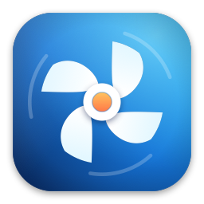

<p align="center">
  
</p>

<h1 align="center">Fanwright</h1>

<p align="center">
  <strong>Fan control and temperature monitoring for Apple Silicon Macs, done the native way.</strong><br>
  See what is running hot, watch the fans in real time, and decide how hard they work.
</p>

<p align="center">
  <a href="https://github.com/kangzj/fanwright/releases/latest"></a>
  
  
  
  
  <a href="LICENSE"></a>
</p>

<p align="center">
  
</p>

## Why Fanwright

Apple's fan curve is tuned for silence, not for sustained load.
macOS lets the chip climb toward 100 °C before the fans spin up in earnest, then relies on thermal throttling to hold the line.
That is a fine trade for a quiet desk while you write email; it is a poor one for the work Macs increasingly do all day.

**Running local LLMs is the new normal, and it is exactly the workload Apple's curve was not tuned for.**
Ollama, LM Studio, MLX, llama.cpp, Stable Diffusion: a 30-billion-parameter model on an M-series chip keeps the GPU and memory fabric pinned for minutes or hours, not seconds.
Under that kind of load the SoC sits at its thermal limit, the fans stay conservative, and the chip throttles to protect itself, so your tokens-per-second drop right when you need them.
Sustained heat is also the thing that ages silicon, batteries, and solder joints fastest.

Fanwright gives you the dial back:

- **Run cooler under load.** A Custom profile such as *GPU above 80 °C → fans at 70 % until below 70 °C* keeps inference and training at full speed instead of throttled.
- **Stay quiet when it does not matter.** Auto mode hands control back to macOS the moment you switch, quit, or the Mac sleeps.
- **See what is actually happening.** Real sensor temperatures, real RPM, a 30-minute trend, and a menu bar readout you can leave on all day.
- **Pre-cool before a long job.** One click of Full Blast brings the fans up ahead of a render or a fine-tuning run.

- **Made for Apple Silicon.** Reads temperatures straight from the System Management Controller and understands the sensor layout of M1 through M5, including M5 quirks.
- **Native, not ported.** SwiftUI, menu bar extra, Swift Charts, dark and light mode, keyboard shortcuts. It feels like part of macOS.
- **Safe by design.** A tiny root helper is the only thing that touches the fans, it clamps every request to the hardware range, and a watchdog returns the fans to Apple's control if the app ever goes away.
- **Free and open source.** MIT licensed, no telemetry, no account.

## Features

### At a glance
The Overview answers three questions: is my Mac hot, what are the fans doing, and which mode am I in.
A colour-coded gauge shows the hottest of CPU and GPU with a plain-language status, next to SSD and battery readings.
Both fans show live RPM and their current target.
Thirty-minute trends are one click away.

### Three ways to run the fans
| Mode | What it does |
|---|---|
| **Auto** | macOS drives the fans. The default, and the state Fanwright always returns to. |
| **Constant** | Hold a fixed speed, per fan or both together. Handy for a long render or a hot room. |
| **Custom** | Follow a profile of rules such as *when the GPU is above 85 °C, run all fans at 70 % until it drops below 75 °C*. |

### Profiles that speak your language
Quiet, Balanced, and Cool ship built in.
Edit them in place, or build your own from rules that trigger on a sensor group (hottest or average), a single sensor, or a threshold with hysteresis so fans do not flap.
Reset a built-in profile to its defaults at any time.

### Full Blast
One click in the toolbar or menu bar runs every fan at maximum for a set time (1 minute by default, up to 30), then hands control back to whatever mode was active.

### Menu bar
A live readout next to the fan icon: GPU by default, or CPU, memory, SSD, battery, the hottest sensor, a favourite sensor, or fan RPM.
The dropdown shows key temperatures, both fans, and the mode switch without opening the window.

### Sensors, all of them
The summary view groups hundreds of raw SMC keys into readings that make sense.
Flip a toggle to see every sensor, rename them, star favourites, and search.

<p align="center">
  
</p>

<p align="center">
  
</p>

## Safety model

Changing fan speed needs root, and root code deserves scrutiny.
Fanwright keeps that surface as small as possible.

- The app itself never writes to the SMC. It only reads.
- A separate helper daemon, registered with Apple's `SMAppService` and approved once in System Settings › Login Items, performs fan writes over XPC.
- The helper clamps every request to the fan's own minimum and maximum.
- If the helper receives no heartbeat from the app for ten seconds while any fan is forced, it restores Auto. This covers crashes and force quits.
- The app restores Auto when it quits, when the Mac sleeps, and whenever the helper reports an error.
- When signed with a Developer ID, the helper accepts connections only from apps signed by the same team.

## Requirements

- macOS 15 Sequoia or later. Tested on macOS 26.
- Apple Silicon Mac with SMC-controlled fans (MacBook Pro, MacBook Air with fans, iMac, Mac mini, Mac Studio). Intel Macs show raw sensors but the names are best effort.

## Install

Download the latest DMG from [Releases](https://github.com/kangzj/fanwright/releases/latest), drag Fanwright to Applications, and open it.
Fan control asks you once to approve the helper in System Settings › Login Items.

Release builds are signed with an Apple Development certificate rather than a notarized Developer ID, so macOS blocks the first launch.
See [Opening an unsigned build](#opening-an-unsigned-build-on-another-mac) below for the two-click fix.

## Build from source

Requirements: Xcode 26 with the license accepted, and [XcodeGen](https://github.com/yonaskolb/XcodeGen).

```sh
git clone https://github.com/kangzj/fanwright.git
cd Fanwright
scripts/build.sh            # Debug build in build/Build/Products/Debug/Fanwright.app
scripts/build.sh Release    # Release build
```

### Building a copy that can control fans

macOS only lets launchd run a privileged helper whose signature comes from an Apple-issued certificate.
An ad-hoc ("Sign to Run Locally") build reads every sensor but shows "Unavailable in this unsigned build" under Settings › Helper, because launchd kills the helper with a launch constraint violation.

A free Apple Development certificate is enough, no paid membership required:

1. In Xcode, open Settings › Accounts, add your Apple ID, and select the Personal Team.
2. Click Manage Certificates…, then + › Apple Development.
3. Find the identity name with `security find-identity -v -p codesigning` and build with it:
   ```sh
   FANWRIGHT_SIGNING_IDENTITY="Apple Development" FANWRIGHT_SIGNING_TEAM=TEAMID scripts/build.sh
   ```

Keep one copy of the app on disk.
launchd caches the helper's requirement per registration, so if you move or rebuild the app and fan control stops responding, click Settings › Helper › Reinstall.

The Xcode project is generated from `project.yml`; do not edit `Fanwright.xcodeproj` by hand.
The app icon is drawn by `scripts/render-icon.swift`; run `swift scripts/render-icon.swift App/Assets.xcassets/AppIcon.appiconset` after changing it.

Tests cover the SMC decoding, sensor catalog, rule engine, and persistence:

```sh
swift test --package-path Packages/FanwrightKit
MACFANS_HW_TESTS=1 swift test --package-path Packages/FanwrightKit   # also exercises the real SMC
```

## Distributing

Other Macs only run the app without warnings if it is signed with a Developer ID certificate and notarized by Apple, which needs an Apple Developer Program membership.

1. Install the "Developer ID Application" certificate in your login keychain and note your Team ID (shown in parentheses by `security find-identity -v -p codesigning`).
2. Store notarization credentials once:
   ```sh
   xcrun notarytool store-credentials fanwright --apple-id you@example.com --team-id TEAMID --password app-specific-password
   ```
3. Build, sign, package, notarize, and staple in one go:
   ```sh
   scripts/release.sh --identity "Developer ID Application" --team TEAMID --notarize-profile fanwright
   ```
   The result is `dist/Fanwright-<version>.dmg`.

Pass an Apple Development identity instead of a Developer ID to get a DMG whose helper works but that is not notarized; recipients need the Open Anyway steps below.
Without `--identity` the script produces an ad-hoc signed DMG in which fan control is unavailable.

### Opening an unsigned build on another Mac

macOS refuses to open a downloaded app that is not notarized and shows "Apple could not verify Fanwright is free of malware".
Right-click › Open no longer bypasses this on macOS 15 and later.
To run it anyway:

1. Drag Fanwright to Applications and double-click it once. Dismiss the dialog.
2. Open System Settings › Privacy & Security and scroll down to the Security section.
3. Next to "Fanwright was blocked to protect your Mac", click **Open Anyway**, then confirm with your password.
4. Double-click Fanwright again. It opens normally from now on.

Alternatively, clear the quarantine flag from Terminal and launch as usual:

```sh
xattr -d com.apple.quarantine /Applications/Fanwright.app
```

## How it works

- `SMCKit` talks to `AppleSMC` through IOKit: key enumeration, typed decoding, fan and temperature accessors.
- `FanwrightCore` is pure Swift: sensor catalog for Apple Silicon keys, the rule engine with hysteresis and lowering dwell, profiles, and JSON persistence. No UI, no IOKit, fully unit tested.
- `App` is the SwiftUI app: a polling monitor, a fan controller that turns mode and rules into helper commands, and the views.
- `Helper` is the root daemon: XPC listener, fan writer with clamping, watchdog.

The design spec and implementation plan live in `docs/superpowers`.

## FAQ

**I run local models all day. Will this help?**
Yes, that is the headline use case.
Watch the GPU reading while a model is loaded: if it sits in the 90s, macOS is throttling.
Activate the built-in Cool profile, or write a rule that kicks the fans in at 75 °C, and the chip holds its clocks instead of shedding them.

**Will this damage my Mac?**
Fanwright only uses the same fan target mechanism macOS uses, never exceeds the hardware limits the SMC reports, and defaults to Apple's control at every opportunity.
Running fans faster wears them slightly sooner; running them slower than Apple would is where you should be thoughtful, which is why Custom rules always fall back to Auto when no rule is active.

**Does it work on Intel Macs?**
It reads fans and sensors, but sensor naming is tuned for Apple Silicon.

**Why does it need a helper?**
Writing to the SMC requires root. Isolating that in a minimal daemon is safer than running the whole app as root.

**Where are my settings?**
`~/Library/Application Support/Fanwright/configuration.json`.

## Contributing

Issues and pull requests are welcome.
Keep changes small, add a test for pure logic, and run `scripts/build.sh` before opening a PR.

## License

MIT. See [LICENSE](LICENSE).

---

<sub>Keywords: macOS fan control, Apple Silicon fan control, MacBook Pro fan speed, M1 M2 M3 M4 M5 fan control, Mac temperature monitor, SMC fan control, CPU GPU temperature menu bar, macOS thermal monitor, fan curve, Mac running hot, Mac thermal throttling, local LLM Mac cooling, Ollama Mac fan speed, LM Studio Mac temperature, MLX Apple Silicon heat, keep MacBook cool, SwiftUI, open source alternative to Macs Fan Control, TG Pro, smcFanControl, iStat Menus.</sub>
