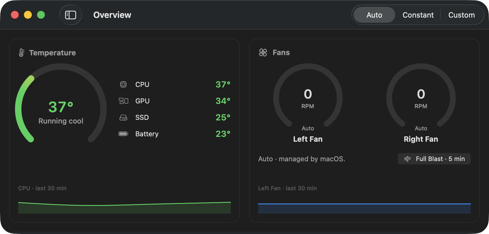
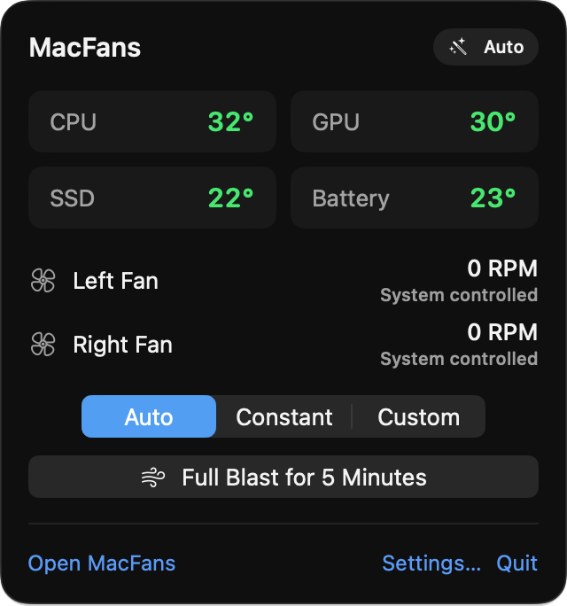
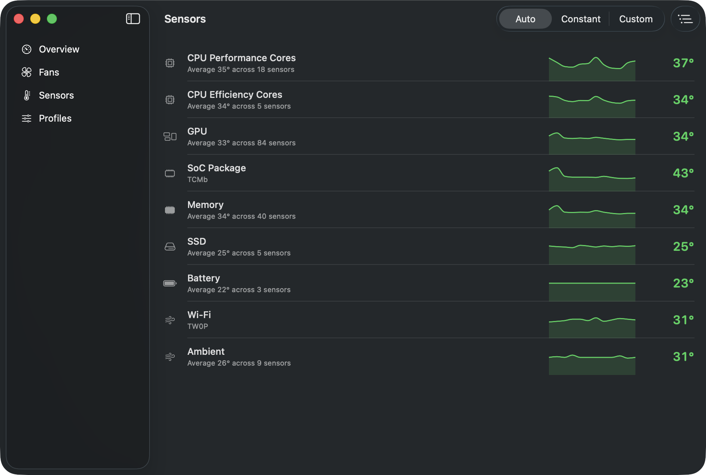
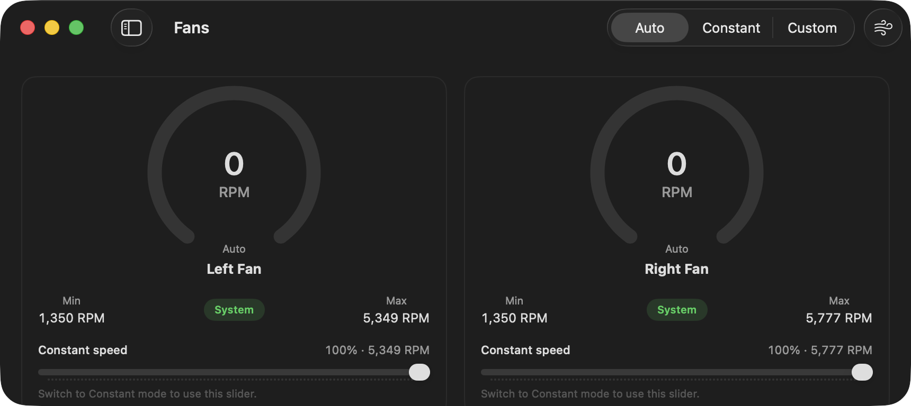
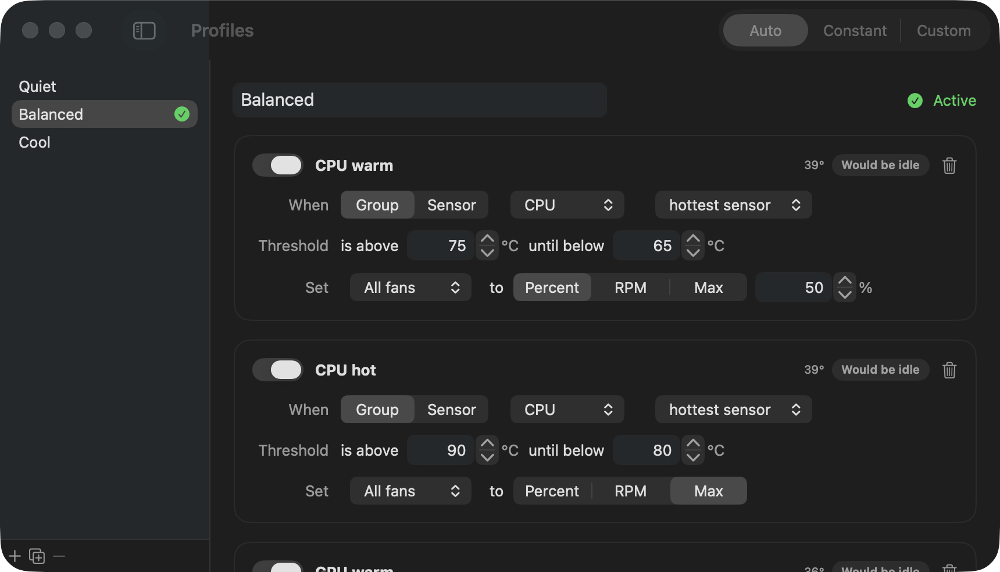

# MacFans

A native macOS app that shows what is running hot and lets you decide how hard the fans work.



## What it does

- Reads temperatures straight from the System Management Controller and groups them into the readings that matter: CPU, GPU, memory, SSD, battery, and SoC.
  Every raw sensor is still one toggle away.
- Shows both fans with live RPM, target, and the range the hardware allows.
- Three control modes:
  - **Auto** hands the fans to macOS. This is the default and the state MacFans always falls back to.
  - **Constant** holds a fixed speed per fan, or moves both together.
  - **Custom** follows a profile of rules such as "when the GPU is above 85 °C, run all fans at 70% until it drops below 75 °C".
    Quiet, Balanced, and Cool profiles are built in and can be duplicated and tuned.
- Lives in the menu bar with a live readout and a one-click "full blast for five minutes".
- Keeps a 30 minute history of temperatures and RPM.

## Screenshots

| Menu bar | Sensors |
|---|---|
|  |  |

| Fans | Profiles |
|---|---|
|  |  |

## Safety

Fan writes never happen in the app.
A small root daemon, installed through `SMAppService` and approved once in System Settings › Login Items, is the only component that touches the fan keys.
It clamps every request to the fan's hardware minimum and maximum, returns every fan to Auto if the app stops sending heartbeats for ten seconds, and restores Auto when it is stopped.
The app itself restores Auto on quit, on sleep, and whenever the helper reports an error.

## Building

Requirements: macOS 15 or later, Xcode 26 with the license accepted, and [XcodeGen](https://github.com/yonaskolb/XcodeGen).

```sh
scripts/build.sh            # Debug build in build/Build/Products/Debug/MacFans.app
scripts/build.sh Release    # Release build
```

The Xcode project is generated from `project.yml`; do not edit `MacFans.xcodeproj` by hand.
The app icon is drawn by `scripts/render-icon.swift`; run `swift scripts/render-icon.swift App/Assets.xcassets/AppIcon.appiconset` after changing it.
Builds are ad-hoc signed, so the helper accepts connections based on the app's bundle identifier.
For distribution, sign both targets with a Developer ID and tighten the requirement in `Helper/HelperListener.swift`.

The helper works best when the app runs from `/Applications`.
Copy the built app there before installing the helper from Settings › Helper.

## Distributing

Other Macs only run the app if it is signed with a Developer ID certificate and notarized by Apple, which needs an Apple Developer Program membership.

1. Install the "Developer ID Application" certificate in your login keychain and note the Team ID shown in parentheses in its name.
2. Store notarization credentials once:
   ```sh
   xcrun notarytool store-credentials macfans --apple-id you@example.com --team-id TEAMID --password app-specific-password
   ```
3. Build, sign, package, notarize, and staple in one go:
   ```sh
   scripts/release.sh --identity "Developer ID Application: Your Name (TEAMID)" --notarize-profile macfans
   ```
   The result is `dist/MacFans-<version>.dmg`.

Without `--identity` the script produces an ad-hoc signed DMG.
Other Macs can still run it, but Gatekeeper blocks the first launch; see below.

### Opening an unsigned build on another Mac

macOS refuses to open a downloaded app that is not notarized and shows "Apple could not verify MacFans is free of malware".
Right-click › Open no longer bypasses this on macOS 15 and later.
To run it anyway:

1. Drag MacFans to Applications and double-click it once. Dismiss the dialog.
2. Open System Settings › Privacy & Security and scroll down to the Security section.
3. Next to "MacFans was blocked to protect your Mac", click **Open Anyway**, then confirm with your password.
4. Double-click MacFans again. It opens normally from now on.

Alternatively, clear the quarantine flag from Terminal and launch as usual:

```sh
xattr -d com.apple.quarantine /Applications/MacFans.app
```

Building from source with `scripts/build.sh` on the target Mac avoids the prompt entirely.
When signed with a Developer ID, the helper automatically requires connecting apps to be signed by the same team, so only MacFans can ask it to change fan speed.

## Tests

```sh
swift test --package-path Packages/MacFansKit
MACFANS_HW_TESTS=1 swift test --package-path Packages/MacFansKit   # also exercises the real SMC
```

## Layout

- `Packages/MacFansKit/Sources/SMCKit` talks to `AppleSMC` through IOKit.
- `Packages/MacFansKit/Sources/MacFansCore` holds the models, the sensor catalog, the rule engine, and JSON persistence. It has no UI or IOKit dependency.
- `App` is the SwiftUI app.
- `Helper` is the root daemon.
- `Shared` is the XPC protocol both sides compile.
- `docs/superpowers` holds the design spec and implementation plan.
